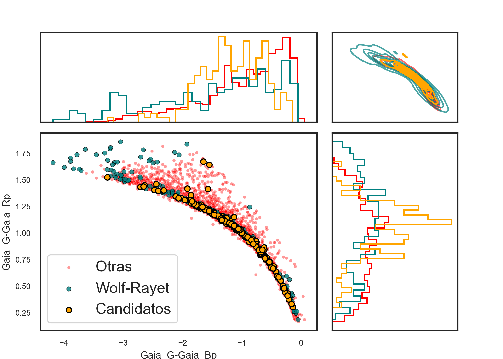
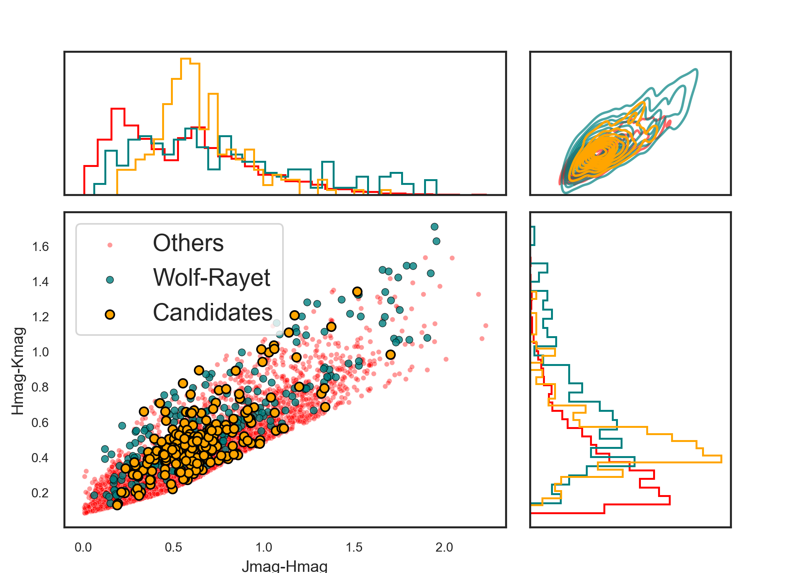
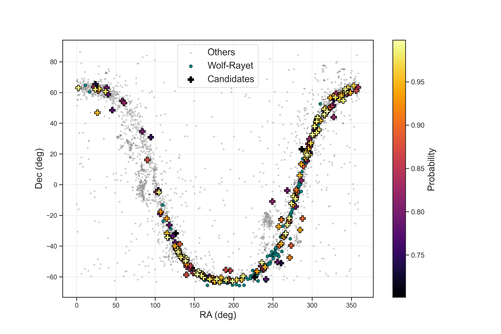

# Search for Wolf-Rayet Star Candidates Using Supervised Models

**Description**:  
This project was part of my research workshop during my bachelor's degree in Astronomy. I used supervised machine learning models (Random Forest and XGBoost) to identify Wolf-Rayet (WR) stars, a rare and unique type of star in the galaxy (with only about 679 known in the Milky Way). The goal was to classify potential WR stars using photometric parameters, as spectroscopic confirmation (the standard method) is expensive and not feasible for all stars in the galaxy. Photometry, while less descriptive, is a more cost-effective alternative.

To improve the model's accuracy, I included **parallax** (a distance measurement) as a feature, accounting for **galactic extinction**—the dimming of a star's observed brightness due to interstellar dust. By combining photometry and parallax, the models could infer a form of **absolute magnitude** (the intrinsic brightness of a star).

**Methodology**:  
1. I applied **linear regression** to both WR and non-WR stars (obtained from the Gaia database using an ADQL query) to identify regions with higher WR density.  
2. The non-WR sample was filtered using a **Kolmogorov-Smirnov (KS) test** to better mimic the characteristics of WR stars.  
3. To address the class imbalance, I applied **oversampling techniques** before training the models.  

**Results**:  
The best-performing model, trained on a dataset of just over 200 WR stars, achieved an **89% recall rate** in detecting Wolf-Rayet stars, meaning it correctly identified 89% of the true WR stars. However, the **precision for the WR class was 56%**, indicating that almost a half of the stars classified as WR were false positives. Given the small sample size and the rarity of WR stars, this result was considered positive, as the primary goal was to maximize the detection of true WR stars.

---

### **Notebooks Description**
The analysis is divided into several Jupyter Notebooks, each focusing on a specific part of the process:

1. **Notebook 1**: Analyzes the distributions of Wolf-Rayet stars using various plots and visualizations.
2. **Notebook 2**: Filters both the WR and non-WR samples and generates corresponding plots.
3. **Notebook 3**: Creates and trains the machine learning models (Random Forest and XGBoost).
4. **Notebook 4**: Makes predictions using the trained models.
5. **Notebook 5**: Plots the distributions of the candidate stars identified by the models.

---

### **Candidates Distribution**

1. **Distribution of candidates by 2 of the 3 Gaia colors**

2. **Distribution of candidates by 2 of the 3 2MASS colors**

3. **Spacial distribution of the candidates by probability**

---

### **Important Note on Data Files**
Due to the large size of some files (several gigabytes), they could not be included in this repository. If you need access to these files, please feel free to contact me at **diegofelipemr@gmail.com**, and I will be happy to provide them.

---

### **Key Points**:
- **Objective**: Identify Wolf-Rayet stars using photometric data and parallax.
- **Models Used**: Random Forest and XGBoost.
- **Techniques**: Linear regression, KS-test filtering, and oversampling.
- **Results**: 89% recall rate and 56% precision in detecting WR stars.

---

### **Technologies Used**:
- Python
- Scikit-learn
- Imbalanced-learn (for oversampling)
- Pandas and Dask
- TOPCAT
- ADQL (for querying the Gaia database)
- Matplotlib and Seaborn (for visualizations)

---

### **Contact**
If you have any questions or need access to the large data files, please contact me:
- Email: diegofelipemr@gmail.com
- LinkedIn: [linkedin.com/in/diego-miranda-83b981216](https://www.linkedin.com/in/diego-miranda-83b981216/)
